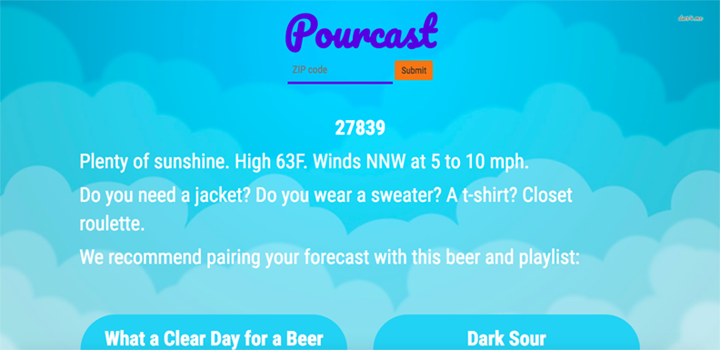
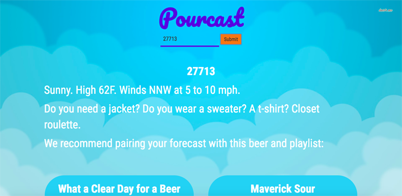
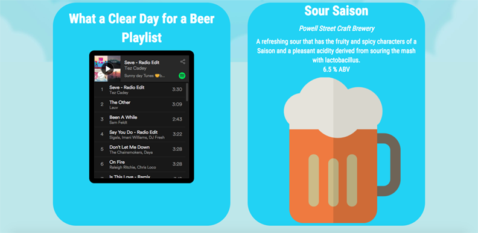
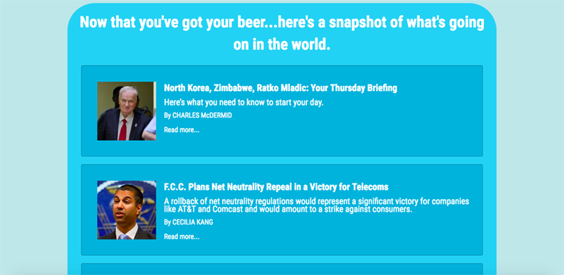
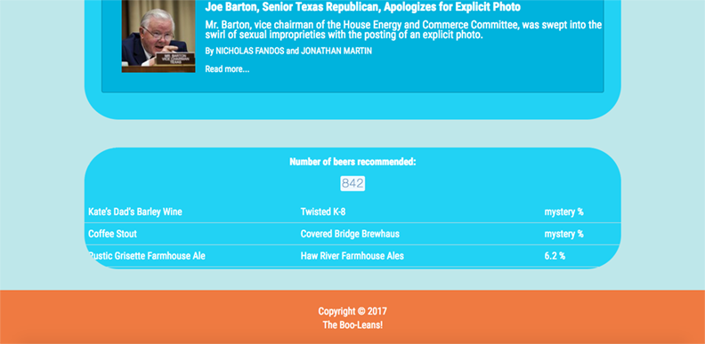

# pourcast
A weather-and-beer app!

Uses IP API to detect your approximate location...

or enter your exact zip code.

# User Story:
A one-stop novelty weather app that will tell you fun and perhaps unnecessarily colorful opinions about the weather, and then tell you which beer to pair with that forecast. Built and designed by Sara Hjelt, <a href="http://github.com/brandon-Pfeiffer">Brandon Pfeiffer</a>, and <a href="http://github.com/catslug">Lindsay Wall</a>.

There are also links to a few top news articles from the New York Times:

And a table at the bottom of the page that shows the most recent 20 beers that've been recommended.

# Technologies Used:
<ul>
<li>HTML</li>
<li>CSS</li>
<li>Bootstrap</li>
<li>Javascript</li>
<li>jQuery</li>
<li>OdometerJS</li>
<li>Firebase</li>
<li>Weather Underground API</li>
<li>BreweryDB API</li>
<li>NYTimes API</li>
<li>IP API</li>
</ul>

